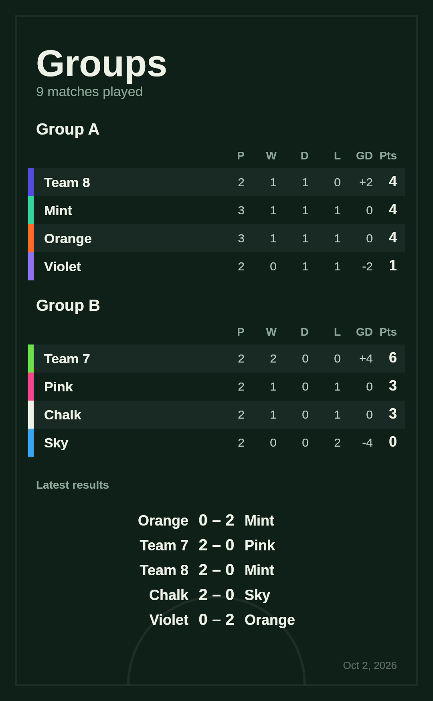
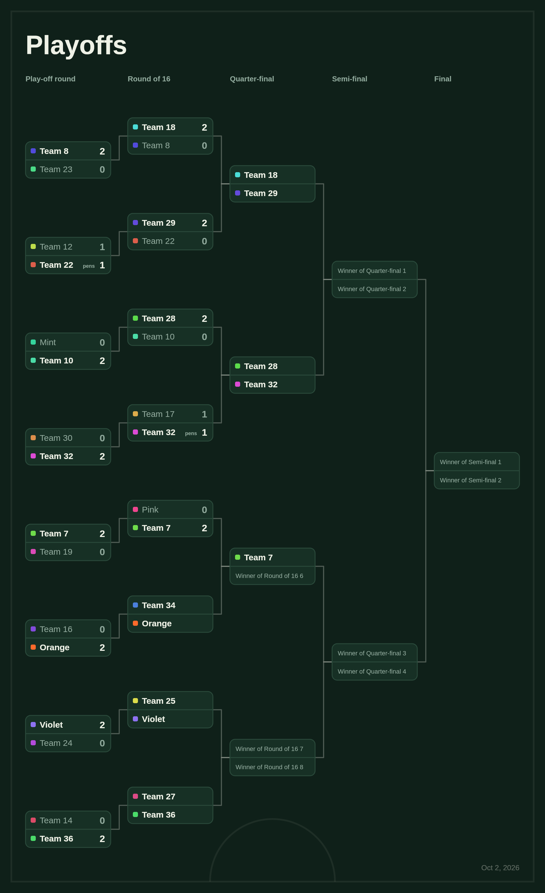

# Pitchside

A mobile-first tournament organizer for casual football groups. Pick the teams, hit start, and the app runs the evening: timer, live score, the next match, tables, brackets, and a share image for the group chat.

It installs to your home screen and works with no signal, so it keeps running on a pitch with bad reception. There is also a native Android app (the same code wrapped with Capacitor).

> Pitchside is a working codename. The final name is still to be decided.

| Groups table share image | 24-team bracket share image |
| --- | --- |
|  |  |

## What it does

**Formats**

- **League:** everyone plays everyone, any number of rounds, optional playoffs afterwards.
- **Groups:** Group A, B, C and so on, drawn at random or by team order, with the best from each group going to the playoffs.
- **Champions League style:** one big table where each team plays a set number of different opponents. Top teams skip the first knockout round and the next ones play off for the remaining places. A shortcut sets up the real numbers (36 teams, 8 matches each, top 24 through).
- **Knockout:** straight to a bracket. Byes for top seeds when the team count is not a power of two, optional third-place match, penalty shootouts for drawn matches.
- **Street rules:** winner stays on (configurable draw rule and streak limit) or a fair rotation, for pickup games with three teams.

**Around the match**

- Up to 64 teams, named bib colours for the first six. Tables show positions, green marks teams that skip the first knockout round and yellow marks the rest of the qualifiers. A finished league shows its champion.
- Match timer with presets or any custom length, survives a page refresh.
- One-tap goals, undo of the last result, auto-generated next match.
- Optional player list with balanced or random splitting into teams.
- Shareable PNG images of tables and brackets, drawn on a canvas in the browser. Sharing sends the picture with a caption that links to the web app, where people can try it or install it.
- English and Russian, switchable from the globe menu in the header. The language is remembered, and the first visit follows the browser language.

## Tech

React 19, TypeScript, Vite, Zustand (persisted to localStorage), `vite-plugin-pwa` (Workbox), Capacitor for Android. No backend: everything runs and is stored on the device.

The tournament logic lives in `src/engine` as plain TypeScript with no React in it, and is covered by Vitest tests: fixture generation, standings tiebreaks, seeded group draws, the league-phase scheduler, bracket seeding with byes, and full simulated tournaments.

```
src/
  engine/      pure tournament logic + tests
  screens/     Setup, Match, Table, Bracket, Results
  components/  format picker, form controls, share actions
  lib/         share-image rendering, timer hook
  store.ts     app state
```

## Run it

```bash
npm install
npm run dev        # http://localhost:5173
npm test           # engine tests
npm run build      # type-check + production build (includes the service worker)
npm run preview    # serve the production build, test install/offline here
```

## Deploy (Firebase Hosting)

The web app is a static site, so Firebase Hosting's free plan is enough.

1. Create a Firebase project and note its project id. Hosting then lives at `https://PROJECT_ID.web.app`.
2. `npm install`, then `npx firebase-tools login`.
3. `npx firebase-tools use --add`, pick the project, and give it the alias `default`. This creates `.firebaserc`, which is safe to commit.
4. `npm run deploy` builds and publishes. `firebase.json` keeps the service worker uncached and the hashed assets cached for a year, so updates reach users quickly.

**Auto-deploy from GitHub:** in the Firebase console open Project settings, Service accounts, Generate new private key. Paste the whole JSON file into a GitHub repository secret named `FIREBASE_SERVICE_ACCOUNT` (Settings, Secrets and variables, Actions), then delete the downloaded file. After that every push to `main` deploys through `.github/workflows/deploy.yml`.

Then add the `APP_URL` variable described below so the Android app's share caption links to the site.

## Share link

The caption that goes with a shared picture links to the deployed web app. In the browser it uses the address the app runs on. The Android app has no web address of its own, so set `VITE_APP_URL` (see `.env.example`) before building it. On GitHub, add a repository variable named `APP_URL` under Settings, Secrets and variables, Actions, Variables. Without it the caption has no link.

To publish the APK that the website's "Download for Android" button points to, push a version tag: `git tag v0.1.0 && git push origin v0.1.0`. The Android workflow attaches the APK to a GitHub release.

## Translations

All text lives in `src/i18n/dict.ts`: `en` is the source of truth and `ru` must have exactly the same keys (TypeScript and a test enforce it). Plurals use `Intl.PluralRules`, so Russian forms such as "1 матч, 3 матча, 5 матчей" work. The tournament engine labels matches in English and the UI translates those labels when it shows them.

To add a language: add it to `Lang` and `LANGS`, copy the `en` block into a new dictionary, add it to `dicts`, and add its default team names to `BIB_NAMES`. The menu picks it up automatically.

## Android app

The Android app is the same web app inside a native shell ([Capacitor](https://capacitorjs.com)). In the app, sharing opens the Android share sheet with the image attached, the screen stays on while a match is running, and the clock buzzes through the native vibration API.

You need Android Studio (or just the Android SDK and Java 21).

```bash
npm install
npm run android:sync   # builds the web app and copies it into the android/ project
npm run android:open   # opens the project in Android Studio, then press Run
```

To get an installable APK without Android Studio, run the **Android APK** workflow on GitHub (Actions tab). It builds a debug APK and attaches it to the run.

For Google Play you need a release build signed with your own key (never commit the keystore) and the app id in `capacitor.config.ts`. After changing the app icon in `assets/`, run `npm run android:icons`.

## Notes on the formats

- The Champions League style mode is an approximation of the league phase used by UEFA since 2024-25: single matches instead of two-legged ties, no pots or draw ceremony, and a random but fixed schedule per session.
- Past results can be corrected by reopening the last match only. Editing older matches in winner-stays or rotation would change everything that came after.

## Roadmap

- Saved friend lists and session history
- Real app name and branding
- More share-image styles

## Contributing

Issues and pull requests are welcome. Please run `npm run lint`, `npm test` and `npm run build` before opening a PR.

## Support

Pitchside is free and open source. If it saved your Sunday kickabout, you can support development with a donation (link coming soon).

## License

[MIT](LICENSE)
